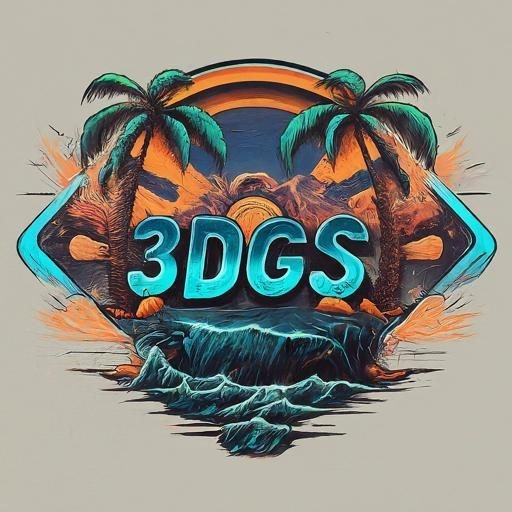
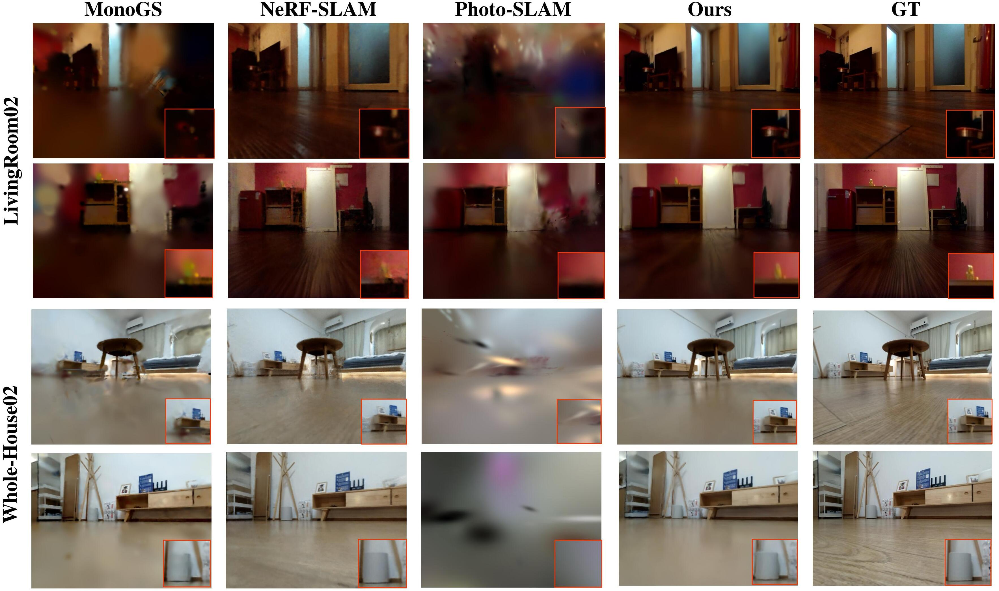
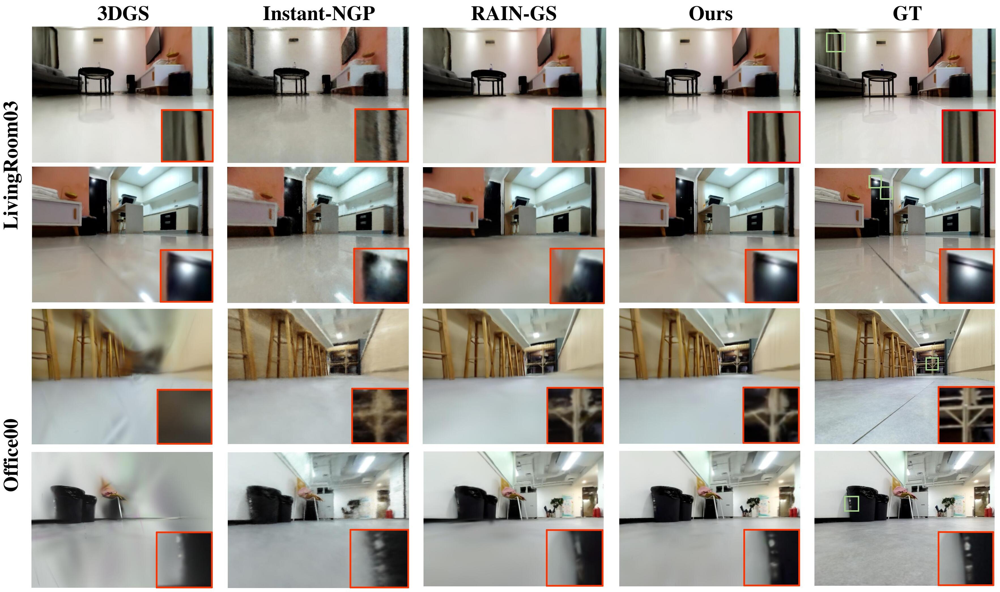
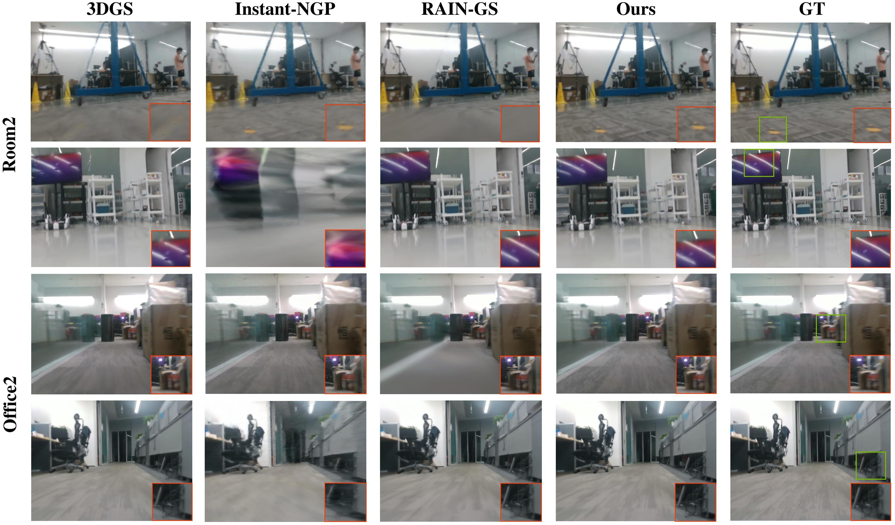

<p align="center">
  <h1 align="center">  <ins>ES-Gaussian</ins> <br>Gaussian Splatting Mapping via Error Space-Based Gaussian Completion</h1>
    <p align="center">
    <a href="https://chenlu-china.github.io/"><strong>Lu Chen</strong></a>
    ·
    <a href="https://scholar.google.com/citations?user=ZmiMmuIAAAAJ&hl=en"><strong>Yingfu Zeng</strong></a>
    ·
    <a href="https://sites.google.com/view/haoangli/homepage/"><strong>Haoang Li</strong></a>
    ·
    <a href="https://github.com/vemacular/"><strong>Zhitao Deng</strong></a>
    ·
    <a href="https://github.com/gongfuxiaoxiong/"><strong>Jiafu Yan</strong></a>
    ·
    <a href="https://ericzzj1989.github.io/"><strong>Zhenjun Zhao*</strong></a>
  </p>

  <div align="center">
    <a href="https://arxiv.org/abs/2410.06613"></a>
    <a href="https://chenlu-china.github.io/ES-Gaussian/"></a>
  </div>
</p>

<p align="center">
  <a href="https://arxiv.org/abs/2410.06613">
    
  </a>
  <br>
  <em>ES-Gaussian is an end-to-end system using a low-altitude camera and single-line LiDAR for high-quality 3D indoor reconstruction.</em>
</p>

## News

The code and data will be made available once the paper is accepted. Please stay tuned!

## Description

For more details, please read our [paper](https://arxiv.org/pdf/2410.06613) and visit our [project page](https://rwn17.github.io/nerf-on-the-go/).

## Qualitative results on our Dreame-SR dataset

<p align="center">
    
</p>

<br>

<p align="center">
    
</p>

## Qualitative results on Ground-Challenge dataset

<p align="center">
    
</p>

## Citation

If you find our code or paper useful, please cite
```bibtex
@article{chen2024esgaussiangaussiansplattingmapping,
  title={ES-Gaussian: Gaussian Splatting Mapping via Error Space-Based Gaussian Completion},
  author={Chen, Lu and Zeng, Yingfu and Li, Haoang and Deng, Zhitao and Yan, Jiafu and Zhao, Zhenjun},
  journal={arXiv preprint arXiv:2410.06613},
  year={2024}
}
```
## Contact
Contact [Lu Chen](mailto:chenlu1@dreame.tech) and [Zhenjun Zhao](mailto:ericzzj89@gmail.com) for questions, comments and reporting bugs.
